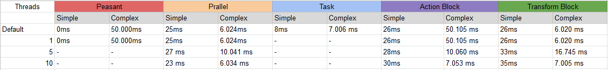

# Multithreading

## Task
Can't set a maximum number of threads. this has to me implemented by hand
#### WaitAll
- cannot continue without the result
#### WhenAll
- is not blocking

## Parallel.Foreach
[https://docs.microsoft.com/en-us/dotnet/standard/parallel-programming/how-to-write-a-simple-parallel-foreach-loop](https://docs.microsoft.com/en-us/dotnet/standard/parallel-programming/how-to-write-a-simple-parallel-foreach-loop)
- When not interested into the output
- Simple to use
- max degree of parallelism
- threading logic like batching is already in place

## Dataflow
[https://docs.microsoft.com/en-us/dotnet/api/system.threading.tasks.dataflow?view=netcore-3.1](https://docs.microsoft.com/en-us/dotnet/api/system.threading.tasks.dataflow?view=netcore-3.1)
- For .net framework System.Threading.Tasks.Dataflow nuget package is necessary
- max degree of parallelism
- if the max degree of parallelism is not set, it will run on only one thread

#### ActionBlock
[https://docs.microsoft.com/en-us/dotnet/api/system.threading.tasks.dataflow.actionblock-1?view=netcore-3.1](https://docs.microsoft.com/en-us/dotnet/api/system.threading.tasks.dataflow.actionblock-1?view=netcore-3.1)
- can recive only one parameter (workaround: make a wrapper class for the inputs)
- no value returned
  
####  TransformBlock
[https://docs.microsoft.com/en-us/dotnet/standard/parallel-programming/how-to-perform-action-when-a-dataflow-block-receives-data](https://docs.microsoft.com/en-us/dotnet/standard/parallel-programming/how-to-perform-action-when-a-dataflow-block-receives-data)
- can recive more than one input
- has a return value
- can continue with another function after completion

# Notes
Using threading on simple function might make the execution slower becouse of all the threading logic involved in the back.

